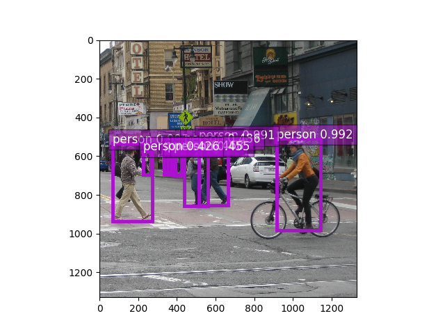

# Pedestrian Detection based on SSD

SSD is an unified framework for object detection with a single network.You can use the code to train/evaluate/test for object detection task.

### what's new

- support multi-machines distributed training via ssh/k8s
- support arbitrary shape for input
- support CoordinateConv

### results

|Model|Training Data |Validating Data|mAP|
|------------|------------|------------|------------|
|inceptionv3(480x270)|coco2017-train-person|coco2017-val-person|0.3511|
|inceptionv3(360x360)|coco2017-train-person|coco2017-val-person|0.3583|
|inceptionv3(360x360)-coorinate|coco2017-train-person|coco2017-val-person|0.4436|

### Demo results

### Usage

demo:

`python demo.py --network inceptionv3 --class-names person --data-shape 360 --prefix your-model-path --epoch your-epoch-num --class-names person --images ./data/demo/street.jpg`

training:

`python train.py --train-path /mnt/datasets/coco/build/person/train-total.rec --val-path /mnt/datasets/coco/build/person/val-total.rec --network densenet121 --data-shape 360 360 --label-width 360 --lr 0.004 --lr-steps 32,64,96 --end-epoch 128 --num-class 1 --class-names person`

evaluate:

`CUDA_VISIBLE_DEVICES=6 python evaluate.py --rec-path /mnt/datasets/coco/build/person/val-total.rec --network inceptionv3 --data-shape 360 360 --num-class 1 --class-names person --prefix /mnt/models/ssd-inception-v1/ssd --epoch 28 --batch-size 16 --gpus 0`
